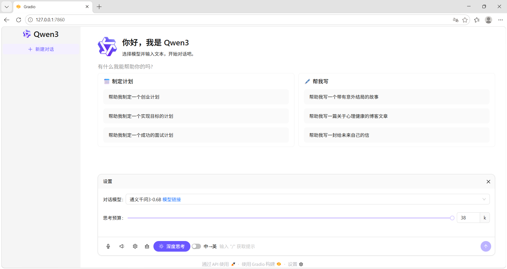

---
项目概述：构建支持语音与文本输入输出的智能问答系统，基于Qwen3大语言模型本地部署，集成faster-whisper语音识别与pyttsx3语音合成，实现多轮对话、流式输出与思考过程可视化。


# 安装依赖
确保 Asw.bat 文件中所指定的 py310 文件夹在父目录中存在（就是一个 python 3.10 的安装文件夹）
再使用 Asw.bat 用 python -m venv venv 命令创建虚拟环境
再使用 Astart.ps1 脚本激活虚拟环境，进入虚拟环境后，执行以下命令安装依赖：

```bash
 pip install -r requirements.txt
```
# 运行该 demo
在虚拟环境中使用以下命令运行该 demo：
```bash
 python app.py
```
# 模型文件夹在 models 目录下
放置好后目录结构应如下：
```bash
├── models
│   ├── Qwen
│       ├── Qwen3-0.6B/
```

具体效果图为


